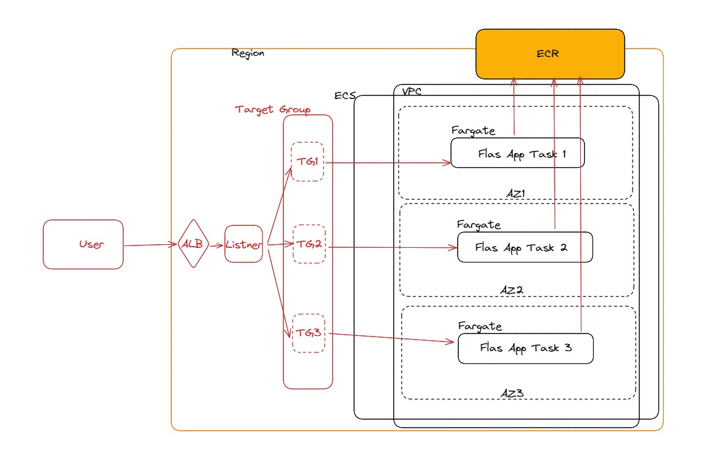

## Overview

A super simple RESTful api created using Flask. The idea is to have a simple api that can be used with pipeline demos and proof of concepts.

## Installation

Requirements:

```sh
python -m venv ./venv
source .venv/bin/activate
```

Next, run

```sh
pip install -r requirements.txt
```

to get the dependencies.

Finally run the api with

```sh
python api.py
```

## Example

Flask will run on http://127.0.0.1:5000/.

```sh
$ curl 127.0.0.1:5000/
[{"id":1,"name":"Monday"},{"id":2,"name":"Tuesday"},{"id":3,"name":"Wednesday"},{"id":4,"name":"Thursday"},{"id":5,"name":"Friday"},{"id":6,"name":"Saturday"},{"id":7,"name":"Sunday"}]
```

To return a single day pass in a number with Monday starting at 1.

```sh
$ curl 127.0.0.1:5000/2
{"day":{"id":2,"name":"Tuesday"}}
```

Days will also accept a post message.

```sh
$ curl -X POST 127.0.0.1:5000/
{"success":true}
```

## Build and Push to ECR Repo

Flask App could get build and pushed to ECR repo by using below script and parameter

```sh
$ ./build-and-push.sh <aws-region-name> <ECR-Repo-URL>
```
aws-region-name : could be eu-west-2 ( Default ) or similar
ECR-Repo-URL : <aws-account-number>.dkr.ecr.<aws-region-name>.amazonaws.com

## Deploy to AWS

Flask App could be deployed to AWS, where it will automatically deploy on AWS ECS with following resources 
* Create an AWS ECS cluster.
* Create an AWS ECS task.
* Create an AWS ECS service.
* Create Default VPC with Subnets
* Create a load balancer.

pre-requisite : you should have .aws/credentials file in your shell with AWS Access and Secret Key

```sh
$ cd terraform
$ ./deploy.sh <aws-region-name> <ECR-Repo-URL>
```

## Working Flow Diagram for AWS Infra creation for Flask App 


